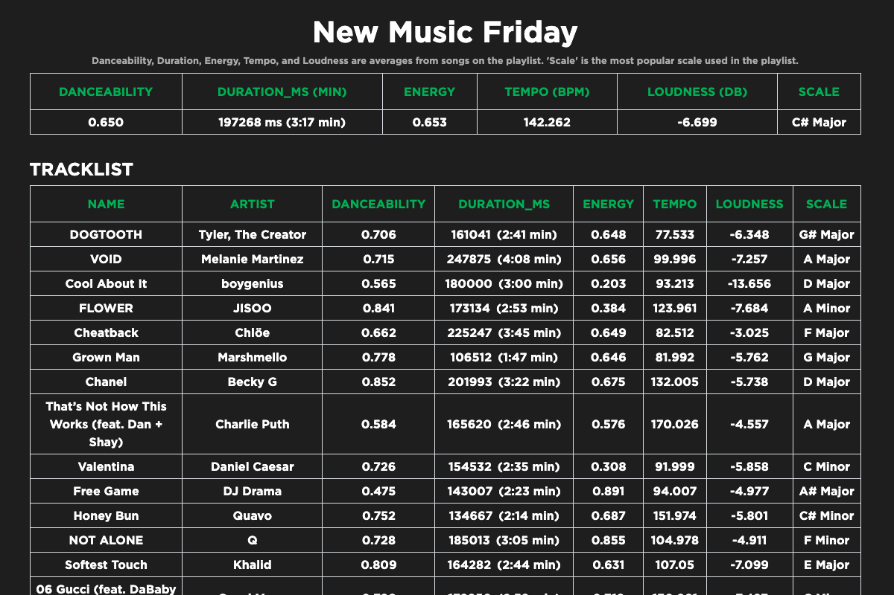

# Spotify Analysis

#### A site that analyzes songs that have made it onto popular Spotify Playlists to spot music trends.

##  Deployed Link
[Spotify Analysis](https://spotify-analysis-af539.web.app/)

## Table of Contents
- [Deployed Link](#deployment)
- [Technologies Used](#technologiesused)
- [Features](#features)
- [Resources](#resources)
- [Future Implementations](#futureimplementations)

##  Technologies Used
- TypeScript
- React.js
- Node.js
- Postgres
- SQL
- Spotify-Web-API-Node
- HTML
- CSS
- React-Bootstrap

##  Features
- Data is fetched from Spotify playlists to show trends in music
- Average Duration, Tempo, Energy, Danceability, Loudness and Most Popular Scale from playlists are calculated

##  Resources:
- [Spotify-Web-API-Node](https://github.com/thelinmichael/spotify-web-api-node#usage)
- [Spotify-API](https://developer.spotify.com/documentation/web-api)
- [Postgres](https://www.postgresql.org/docs/11/datatype.html)

##  Future Implementations:
- Search Playlists
- Search by Artist
- Search by Album
